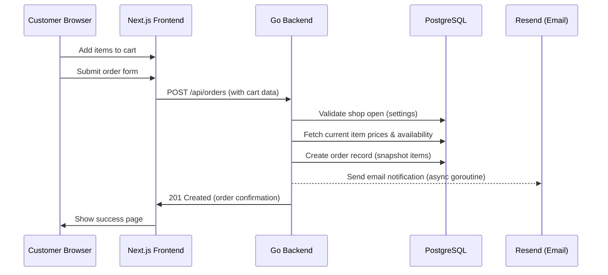
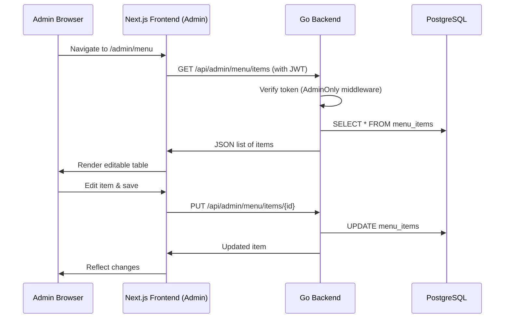
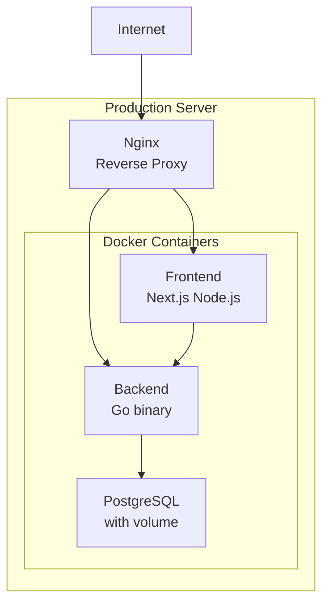

# System Architecture

## Overview

Viva Napoli is a modern, high‑performance web application designed for a pizzeria’s online ordering and management needs. The system follows a **decoupled architecture** where a Next.js frontend communicates with a Go backend via a REST API. This separation allows independent scaling, easier maintenance, and a clear separation of concerns.

The architecture is built with **performance, reliability, and developer experience** in mind:

- **Frontend** uses Next.js 16 with the App Router for optimal server‑side rendering and client‑side interactivity.
- **Backend** is a lightweight Go service that leverages PostgreSQL for data persistence and `sqlc` for type‑safe SQL.
- **Infrastructure** is containerized with Docker and orchestrated via Docker Compose, ready for production deployment.

## Technology Stack

| Layer              | Technology                     | Purpose                                                      |
| ------------------ | ------------------------------ | ------------------------------------------------------------ |
| **Frontend**       | Next.js 16 (App Router)        | React framework with SSR, file‑based routing, and API routes |
|                    | TypeScript                     | Static typing and improved developer experience              |
|                    | Tailwind CSS 4                 | Utility‑first CSS framework for responsive design            |
|                    | Zustand                        | Lightweight state management with persistence                |
|                    | Lucide React                   | Consistent icon set                                          |
|                    | Vitest + React Testing Library | Unit and integration testing                                 |
| **Backend**        | Go 1.22+                       | High‑performance, compiled language for the REST API         |
|                    | Chi Router                     | Lightweight, idiomatic HTTP router for Go                    |
|                    | sqlc                           | Type‑safe SQL query generation from SQL files                |
|                    | pgx v5                         | PostgreSQL driver with native support for advanced types     |
|                    | golang‑migrate                 | Database schema migration tool                               |
|                    | Resend API                     | Transactional email delivery                                 |
| **Database**       | PostgreSQL 16                  | Primary relational database with JSONB support               |
| **Infrastructure** | Docker + Docker Compose        | Containerization and local development orchestration         |
|                    | Nginx (production)             | Reverse proxy and SSL termination                            |
|                    | GitHub Actions (optional)      | CI/CD automation                                             |

## System Components

### 1. Frontend Application (`/frontend`)

The frontend is a **Next.js 16** application using the **App Router**. It is structured as a hybrid application with both server and client components:

- **Server Components** (`app/*.tsx`): Used for the main menu page (`/`) to ensure fast initial page load and SEO. Data fetching happens on the server with native `fetch` and revalidation tags.
- **Client Components** (`components/*.tsx`): Interactive parts of the UI (cart, admin dashboard, modals) that require React state and effects.
- **State Management**: Zustand stores (`/frontend/store`) manage the shopping cart (`useCartStore`) and navigation state (`useNavStore`). The cart is persisted to `localStorage` via the `persist` middleware.
- **Admin Dashboard**: Protected routes under `/app/admin` with client‑side authentication checks and a dedicated layout.

### 2. Backend API (`/backend`)

The backend is a **monolithic Go service** that exposes a RESTful API. Its internal organization follows the **Handler Pattern**:

- **`Handler` struct** (`internal/handler/handler.go`): Central dependency container holding database queries, configuration, and external service clients.
- **Routing**: Chi router groups endpoints by access level (public vs admin) and applies middleware (logging, CORS, authentication).
- **Business Logic**: Each handler validates input, interacts with the database via `sqlc`‑generated methods, and returns JSON responses.
- **External Integrations**: Resend for email notifications, sent asynchronously in a goroutine to avoid blocking the HTTP response.

### 3. Database (`PostgreSQL 16`)

PostgreSQL serves as the single source of truth for all persistent data:

- **Schema**: Defined via migration files (`/backend/internal/db/migrations/`).
- **Type‑Safe Queries**: SQL templates in `/backend/internal/db/queries/` are compiled by `sqlc` into Go interfaces.
- **JSONB Snapshots**: The `orders.items` column stores a JSON snapshot of ordered items at the time of purchase, protecting against price changes.
- **Enums**: Used for `order_status` and `order_type` to ensure data integrity.

### 4. External Services

- **Resend**: Sends transactional email notifications to the restaurant owner when a new order is placed. The integration is fault‑tolerant; email failures are logged but do not roll back the order.
- (Optional) **Payment Gateway**: Not yet integrated; the current flow assumes payment on pickup/delivery.

## Data Flow

### Customer Places an Order

### Admin Manages Menu

## Deployment Architecture

### Development Environment

- **Docker Compose** starts three services:
  1. `postgres` – PostgreSQL 16 with a persistent volume.
  2. `backend` – Go API server (hot‑reloaded via `air` or `go run`).
  3. `frontend` – Next.js dev server (port 3000).
- The frontend connects to the backend via `NEXT_PUBLIC_API_URL=http://localhost:8080/api`.

### Production Environment

- **Nginx** acts as a reverse proxy, handles SSL termination, and serves static assets.
- **Backend** runs as a stateless binary; multiple instances can be scaled horizontally.
- **Frontend** is built with `npm run build` and served by the Next.js production server (or a static export if applicable).
- **PostgreSQL** runs as a single instance with regular backups; for higher load, a read‑replica could be added.

## Scalability Considerations

- **Stateless Backend**: The Go API stores no session data; any instance can handle any request. This allows easy horizontal scaling behind a load balancer.
- **Database Bottleneck**: PostgreSQL is currently a single point of failure. For higher traffic, consider:
  - Connection pooling (e.g., PgBouncer).
  - Read‑only replicas for reporting and admin queries.
  - Caching of public menu data (Redis).
- **Frontend**: Next.js can be deployed as a static site (SSG) for the menu page, reducing server load. The admin dashboard remains server‑side rendered for dynamic data.

## Monitoring & Observability

- **Structured Logging**: The Go backend uses `slog` for JSON‑formatted logs, compatible with ELK stack or cloud logging services.
- **Health Endpoint**: `GET /health` provides a basic liveliness probe for Kubernetes or Docker health checks.
- **Metrics**: Currently not implemented; could be added via Prometheus metrics middleware and visualized with Grafana.
- **Error Tracking**: Sentry or similar services can be integrated for client‑side and server‑side error reporting.

## Security Architecture

- **Authentication**: JWT‑based authentication for the admin panel. Tokens are signed with HS256 and have a 24‑hour expiration.
- **Authorization**: All admin routes are protected by the `AdminOnly` middleware that validates the Bearer token.
- **Password Security**: Bcrypt with cost factor 12.
- **CORS**: Restricted to origins defined in `ALLOWED_ORIGINS` (e.g., the production frontend domain).
- **Input Validation**: Every POST/PUT request is validated both structurally (JSON schema) and semantically (business rules).
- **Price Snapshotting**: Orders store a snapshot of item prices at purchase time, preventing price‑tampering attacks.

## Future Evolution

The architecture is designed to accommodate gradual evolution:

1. **Microservices**: High‑traffic components (email service, payment processing) could be split into separate services.
2. **Event‑Driven Architecture**: Order creation could emit events to a message queue (e.g., NATS, RabbitMQ) for downstream processing (analytics, kitchen display).
3. **Mobile App**: The same REST API can serve a React Native or Flutter mobile application.
4. **Internationalization**: The frontend can be extended with `next‑intl` for multi‑language support.

---

_Last updated: April 2026_
