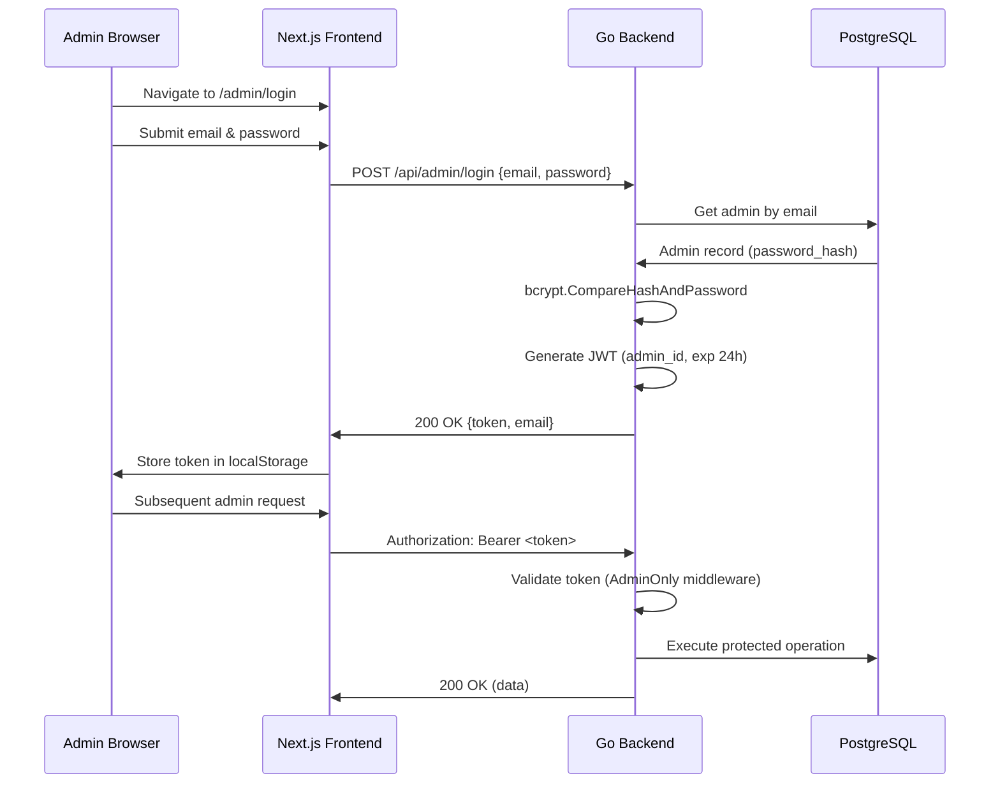

# Authentication & Security

## Overview

The Viva Napoli admin panel is protected by a custom **JWT‑based authentication** system. No external auth providers (like Auth0 or Firebase) are used, keeping the system lightweight and self‑contained. This document describes the authentication flow, security measures, and operational guidelines for maintaining a secure production environment.

## Admin Authentication Flow



### Step‑by‑Step Details

1. **Login Request**
   - The frontend sends a `POST /api/admin/login` with JSON payload `{"email": "...", "password": "..."}`.
   - Email and password are required; missing fields result in a `400 Bad Request`.

2. **Credential Verification**
   - The backend queries the `admin_users` table by email. If no user is found, a generic **“invalid credentials”** response is returned (`401 Unauthorized`) to prevent email enumeration.
   - The stored bcrypt hash is compared with the provided password using `bcrypt.CompareHashAndPassword`. A mismatch also yields “invalid credentials”.

3. **Token Issuance**
   - Upon successful verification, a JWT is generated with the following claims:
     - `admin_id` – numeric ID of the admin user.
     - `exp` – expiration time (current time + 24 hours).
     - `iat` – issued‑at time.
   - The token is signed with **HS256** using the `JWT_SECRET` environment variable.

4. **Client‑Side Storage**
   - The frontend receives the token and stores it in `localStorage` under the key `viva-admin-token`.
   - The token is also kept in memory (Zustand store) for immediate access.

5. **Authorized Requests**
   - For every subsequent request to `/api/admin/*`, the frontend adds the header:
     ```
     Authorization: Bearer <token>
     ```
   - The backend’s `AdminOnly` middleware validates the token before allowing access to the handler.

## Security Implementation

### Backend: `AdminOnly` Middleware

All routes under `/api/admin/*` (except `/api/admin/login`) are wrapped by the `AdminOnly` middleware (`backend/internal/handler/admin.go`). The middleware performs the following checks:

1. **Header Presence**: Ensures the `Authorization` header exists.
2. **Bearer Format**: Expects `Bearer <token>`; any other format is rejected.
3. **JWT Parsing**: Parses the token using `jwt.Parse` with the HS256 signing method.
4. **Signature Verification**: Validates the token’s signature against `JWT_SECRET`.
5. **Expiration**: Checks the `exp` claim; expired tokens are rejected.
6. **Claim Extraction**: Extracts `admin_id` from the claims and injects it into the request’s `context.Context` for potential audit logging or permission checks.

If any step fails, the middleware returns a `401 Unauthorized` with a JSON error message.

### Password Security

- **Hashing Algorithm**: bcrypt with a **cost factor of 12**. This provides a good balance between security and performance.
- **Storage**: The `admin_users` table stores only the hash (`password_hash` column); plain‑text passwords are never persisted.
- **Creation**: The default admin user is seeded via the `make seed` command (email: `admin@vivanapoli.no`, password: `admin123`). **This password must be changed immediately after the first login.**

### Frontend Protection

- **Authentication Hook**: The `useAdminAuth` custom hook (`frontend/lib/useAdminAuth.ts`) monitors API responses. If a `401 Unauthorized` is received, the hook automatically clears the token from `localStorage` and redirects the user to `/admin/login`.
- **Route Guarding**: Protected routes (e.g., `/app/admin/*`) check for the presence of a valid token before rendering. This prevents “flashing” of unauthorized content.
- **Token Persistence**: The token is persisted across page refreshes via `localStorage`. This is a deliberate trade‑off between convenience and security (see **Security Considerations** below).

## Environment Requirements

| Variable          | Description                                                                                               | Example                         |
| ----------------- | --------------------------------------------------------------------------------------------------------- | ------------------------------- |
| `JWT_SECRET`      | High‑entropy secret used to sign JWTs. Must be **at least 32 characters** and kept strictly confidential. | `openssl rand -base64 32`       |
| `ALLOWED_ORIGINS` | Comma‑separated list of origins permitted for CORS. Should match the production frontend domain.          | `https://vivanapolinotodden.no` |

**Important**: The `JWT_SECRET` must be rotated if there is any suspicion of compromise. Rotating the secret invalidates all previously issued tokens, forcing all admins to log in again.

## Security Considerations & Best Practices

### 1. Token Storage (localStorage vs. Cookies)

The current implementation stores the JWT in `localStorage`. This approach is simple but exposes the token to XSS attacks if the application has a cross‑site scripting vulnerability. In a production environment, consider the following enhancements:

- **HttpOnly Cookies**: Store the token in an `HttpOnly` cookie, which is inaccessible to JavaScript and therefore immune to XSS theft. This requires changes to the backend (setting the cookie) and frontend (sending it automatically).
- **Short‑Lived Tokens + Refresh Tokens**: Issue short‑lived access tokens (e.g., 15 minutes) and long‑lived refresh tokens stored securely. The refresh token can be used to obtain a new access token without requiring the user to re‑enter credentials.

### 2. Password Policy

The system currently does not enforce a password policy. For production, it is recommended to:

- Require a minimum length (e.g., 12 characters).
- Encourage the use of password managers.
- Implement a **password reset** flow (via email) for forgotten passwords.

### 3. Brute‑Force Protection

The login endpoint is vulnerable to brute‑force attacks. Mitigation strategies include:

- **Rate Limiting**: Implement a rate‑limiting middleware (e.g., based on IP) that allows a limited number of login attempts per minute.
- **Account Lockout**: Temporarily lock an account after a threshold of failed attempts (e.g., 5). Lockout duration can increase with subsequent failures.

### 4. HTTPS Enforcement

All authentication traffic must be transmitted over HTTPS. In production, ensure:

- The backend is behind a reverse proxy (Nginx) that terminates TLS.
- The frontend is served over HTTPS.
- HSTS headers are set to prevent downgrade attacks.

### 5. Security Headers

The backend should include security‑related HTTP headers:

- `Strict‑Transport‑Security` (HSTS) to enforce HTTPS.
- `Content‑Security‑Policy` (CSP) to mitigate XSS.
- `X‑Content‑Type‑Options: nosniff` and `X‑Frame‑Options: DENY` to prevent MIME sniffing and clickjacking.

These headers can be added via the reverse proxy or directly in the Go middleware.

### 6. Regular Security Audits

- **Dependency Scanning**: Use tools like `npm audit` and `go list -json -m all | go-mod-outdated` to identify vulnerable dependencies.
- **Secret Scanning**: Ensure secrets (JWT_SECRET, database credentials) are never committed to version control.
- **Penetration Testing**: Periodically test the application for common vulnerabilities (OWASP Top 10).

## Operational Guidelines

### Rotating JWT_SECRET

1. Generate a new secret:
   ```bash
   openssl rand -base64 32
   ```
2. Update the `JWT_SECRET` environment variable in all deployment environments (`.env` files, Docker Compose, Kubernetes secrets).
3. Restart the backend service(s).
4. All existing tokens will become invalid; admin users will be logged out and need to log in again.

### Responding to a Suspected Breach

If an admin account is suspected to be compromised:

1. Immediately change the password for the affected account (via direct database update if necessary).
2. Rotate the `JWT_SECRET` to invalidate all sessions.
3. Review server logs for suspicious activity.
4. Consider forcing a password reset for all admin users.

### Adding New Admin Users

Currently, admin users can only be added directly to the database. Example SQL:

```sql
INSERT INTO admin_users (email, password_hash)
VALUES ('newadmin@example.com', crypt('strongpassword', gen_salt('bf', 12)));
```

A future enhancement could provide a user‑management UI within the admin dashboard.

## Future Enhancements

- **Multi‑Factor Authentication (MFA)**: Add TOTP (Time‑based One‑Time Password) support for an additional layer of security.
- **Role‑Based Access Control (RBAC)**: Introduce roles (e.g., “manager”, “kitchen staff”) with different permissions.
- **Audit Logging**: Record all admin actions (who, what, when) for accountability.

---

_Last updated: April 2026_
