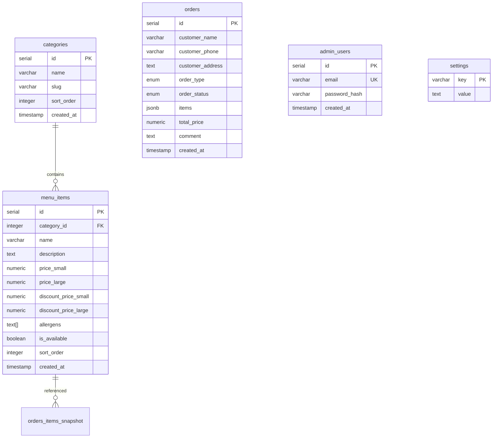

# Database Schema

## Overview

The Viva Napoli application uses **PostgreSQL 16** as its primary relational database. The schema is designed to support the restaurant’s core operations: menu management, order processing, and admin authentication.

- **Migrations**: Managed by [`golang‑migrate`](https://github.com/golang-migrate/migrate). Each migration is a pair of `.up.sql` and `.down.sql` files located in `backend/internal/db/migrations/`.
- **Type‑Safe Queries**: We use [`sqlc`](https://sqlc.dev/) to generate Go code from SQL templates (`backend/internal/db/queries/`). This ensures compile‑time safety and reduces boilerplate.
- **JSONB Snapshots**: The `orders.items` column stores a snapshot of ordered items at the time of purchase, protecting against price changes and preserving historical accuracy.

## Entity‑Relationship Diagram



## Tables in Detail

### `categories`

Stores menu sections (e.g., Pizza, Pasta, Drinks). Categories are displayed in the UI ordered by `sort_order`.

| Column       | Type        | Constraints                        | Description                                                        |
| ------------ | ----------- | ---------------------------------- | ------------------------------------------------------------------ |
| `id`         | `SERIAL`    | PRIMARY KEY                        | Auto‑incrementing unique identifier.                               |
| `name`       | `VARCHAR`   | NOT NULL                           | Display name of the category (e.g., “Pizza”).                      |
| `slug`       | `VARCHAR`   | NOT NULL, UNIQUE                   | URL‑friendly identifier (e.g., “pizza”). Used for routing and SEO. |
| `sort_order` | `INTEGER`   | NOT NULL, DEFAULT 0                | Determines the order in which categories appear in the UI.         |
| `created_at` | `TIMESTAMP` | NOT NULL DEFAULT CURRENT_TIMESTAMP | Time of creation (automatically set).                              |

**Indexes**: `CREATE INDEX idx_categories_sort_order ON categories(sort_order);`

### `menu_items`

Stores individual products that belong to a category. Each item can have two sizes (small/large) with separate prices and optional discount prices.

| Column                 | Type           | Constraints                                              | Description                                                            |
| ---------------------- | -------------- | -------------------------------------------------------- | ---------------------------------------------------------------------- |
| `id`                   | `SERIAL`       | PRIMARY KEY                                              | Auto‑incrementing unique identifier.                                   |
| `category_id`          | `INTEGER`      | NOT NULL, REFERENCES `categories(id)` ON DELETE RESTRICT | The category this item belongs to.                                     |
| `name`                 | `VARCHAR`      | NOT NULL                                                 | Product name (e.g., “Margherita”).                                     |
| `description`          | `TEXT`         | NULL                                                     | Ingredients or other descriptive text.                                 |
| `price_small`          | `NUMERIC(8,2)` | NULL                                                     | Standard price for the small size. If `NULL`, the size is not offered. |
| `price_large`          | `NUMERIC(8,2)` | NULL                                                     | Standard price for the large size. If `NULL`, the size is not offered. |
| `discount_price_small` | `NUMERIC(8,2)` | NULL                                                     | Promotional price for small size.                                      |
| `discount_price_large` | `NUMERIC(8,2)` | NULL                                                     | Promotional price for large size.                                      |
| `allergens`            | `TEXT[]`       | NOT NULL DEFAULT '{}'                                    | Array of allergen labels (e.g., `{"gluten","lactose"}`).               |
| `is_available`         | `BOOLEAN`      | NOT NULL DEFAULT TRUE                                    | When `FALSE`, the item is hidden from the public menu.                 |
| `sort_order`           | `INTEGER`      | NOT NULL DEFAULT 0                                       | Order within its category.                                             |
| `created_at`           | `TIMESTAMP`    | NOT NULL DEFAULT CURRENT_TIMESTAMP                       | Time of creation.                                                      |

**Indexes**:

- `CREATE INDEX idx_menu_items_category_id ON menu_items(category_id);`
- `CREATE INDEX idx_menu_items_is_available ON menu_items(is_available) WHERE is_available = TRUE;`

### `orders`

Stores customer orders and their lifecycle. The `items` column contains a JSON snapshot of the ordered items (name, price, quantity) at the time of purchase.

| Column             | Type           | Constraints                        | Description                                                      |
| ------------------ | -------------- | ---------------------------------- | ---------------------------------------------------------------- |
| `id`               | `SERIAL`       | PRIMARY KEY                        | Auto‑incrementing order identifier.                              |
| `customer_name`    | `VARCHAR`      | NOT NULL                           | Contact person’s name.                                           |
| `customer_phone`   | `VARCHAR`      | NOT NULL                           | Phone number (Norwegian format, 8 digits).                       |
| `customer_address` | `TEXT`         | NOT NULL                           | Delivery address; required for `delivery` orders.                |
| `order_type`       | `order_type`   | NOT NULL                           | Enum: `delivery` or `pickup`.                                    |
| `order_status`     | `order_status` | NOT NULL DEFAULT 'new'             | Enum: `new`, `confirmed`, `preparing`, `ready`, `delivered`.     |
| `items`            | `JSONB`        | NOT NULL                           | Snapshot of ordered items (see `orderItemSnapshot` in the code). |
| `total_price`      | `NUMERIC(8,2)` | NOT NULL                           | Total order cost at the time of purchase.                        |
| `comment`          | `TEXT`         | NULL                               | Additional customer instructions.                                |
| `created_at`       | `TIMESTAMP`    | NOT NULL DEFAULT CURRENT_TIMESTAMP | Time the order was placed.                                       |

**Indexes**:

- `CREATE INDEX idx_orders_created_at ON orders(created_at DESC);`
- `CREATE INDEX idx_orders_status ON orders(order_status);`

**Enums**:

```sql
CREATE TYPE order_type AS ENUM ('delivery', 'pickup');
CREATE TYPE order_status AS ENUM ('new', 'confirmed', 'preparing', 'ready', 'delivered');
```

### `admin_users`

Stores credentials for the admin dashboard.

| Column          | Type        | Constraints                        | Description                              |
| --------------- | ----------- | ---------------------------------- | ---------------------------------------- |
| `id`            | `SERIAL`    | PRIMARY KEY                        | Auto‑incrementing user identifier.       |
| `email`         | `VARCHAR`   | NOT NULL UNIQUE                    | Login email address.                     |
| `password_hash` | `VARCHAR`   | NOT NULL                           | Bcrypt‑hashed password (cost factor 12). |
| `created_at`    | `TIMESTAMP` | NOT NULL DEFAULT CURRENT_TIMESTAMP | Time the account was created.            |

**Indexes**: `CREATE UNIQUE INDEX idx_admin_users_email ON admin_users(email);`

### `settings`

Simple key‑value store for restaurant configuration (opening hours, phone number, etc.).

| Column  | Type      | Constraints | Description                                      |
| ------- | --------- | ----------- | ------------------------------------------------ |
| `key`   | `VARCHAR` | PRIMARY KEY | Setting name (e.g., `opening_hours`, `is_open`). |
| `value` | `TEXT`    | NOT NULL    | Setting value (often a JSON string).             |

## Relationships

- **Categories → Menu Items**: One‑to‑many. A category can contain many menu items; each item belongs to exactly one category.
- **Menu Items → Orders**: Indirect via the `items` JSONB snapshot. The snapshot includes `menu_item_id` references, but there is no foreign‑key constraint (to allow deletion of menu items while preserving historical orders).

## Migration Workflow

1. **Create a new migration**

   ```bash
   make migrate-create name=description_of_change
   ```

   This creates a pair of `.up.sql` and `.down.sql` files in `backend/internal/db/migrations/`.

2. **Write the SQL**
   - The `.up.sql` file contains the changes to apply (CREATE TABLE, ALTER, etc.).
   - The `.down.sql` file contains the exact opposite (DROP TABLE, ALTER) to revert the migration.

3. **Apply migrations**

   ```bash
   make migrate-up
   ```

   This runs `migrate -path ./migrations -database "$DB_URL" up`.

4. **Rollback if needed**
   ```bash
   make migrate-down
   ```
   Rolls back the last applied migration.

**Important**: Never edit a migration after it has been applied to a production database. Instead, create a new migration that corrects the schema.

## Data Seeding

The project includes a seed command that populates the database with initial categories, menu items, and a default admin user.

```bash
make seed
```

The seed data is defined in `backend/cmd/seed/main.go`. The default admin credentials are:

- **Email**: `admin@vivanapoli.no`
- **Password**: `admin123`

**Change this password immediately after the first login.**

## Performance Considerations

- **Indexes**: The indexes listed above are minimal but sufficient for the expected load. Monitor query performance in production and add indexes as needed (e.g., on `menu_items.category_id`).
- **JSONB Queries**: The `orders.items` column is not queried directly; it is only retrieved for display. No JSONB indexes are currently required.
- **Connection Pooling**: The Go backend uses `pgx` connection pooling; ensure `max_connections` in PostgreSQL is set appropriately for the deployment scale.

## Backup Strategy

1. **Regular Snapshots**: Use `pg_dump` daily (or more frequently) to create logical backups.
   ```bash
   pg_dump -h localhost -U vivanapoli -d vivanapoli -F c -f backup.dump
   ```
2. **Point‑In‑Time Recovery (PITR)**: Enable WAL archiving for continuous backup and point‑in‑time recovery.
3. **Off‑Site Storage**: Store backups in a separate location (e.g., cloud storage) with retention policies.

## Monitoring

- **Table Growth**: Monitor table sizes (`pg_total_relation_size`) to anticipate storage needs.
- **Slow Queries**: Enable `log_min_duration_statement` to identify queries that need optimization.
- **Connection Count**: Alert on high connection usage (接近 `max_connections`).

## Future Evolution

- **Audit Tables**: Add `created_by`, `updated_at`, `updated_by` columns for traceability.
- **Soft Deletes**: Introduce `deleted_at` timestamps instead of physical deletion.
- **Partitioning**: The `orders` table could be partitioned by `created_at` (monthly) for easier maintenance and faster queries on recent data.

---

_Last updated: April 2026_
