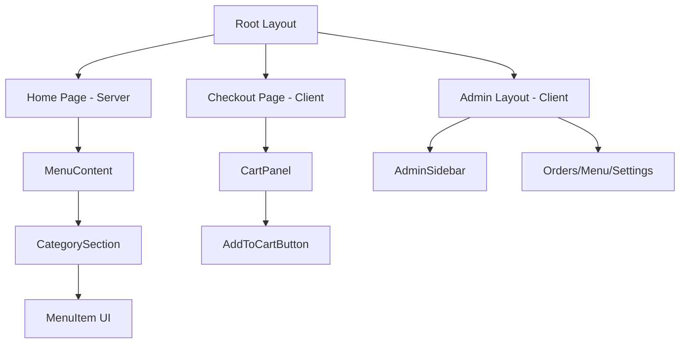

# Frontend Internals

## Overview

The Viva Napoli frontend is a modern React application built with **Next.js 16 (App Router)** and TypeScript. It is designed for high performance, excellent developer experience, and seamless user interaction. This document details the architecture, component structure, state management, styling, and development workflows.

## Architecture: Next.js 16 App Router

The application uses the **App Router** introduced in Next.js 13/14 (still present in Next.js 16), which provides a file‑based routing system with support for **Server Components**, **Client Components**, and advanced data‑fetching patterns.

### Server Components vs Client Components

| Aspect            | Server Components                          | Client Components                    |
| ----------------- | ------------------------------------------ | ------------------------------------ |
| **Location**      | `app/*.tsx` (default)                      | Files with `"use client"` directive  |
| **Bundle Size**   | Zero JavaScript shipped to the client      | JavaScript included in client bundle |
| **Data Fetching** | Direct `fetch` with caching & revalidation | `useEffect` / SWR / TanStack Query   |
| **Interactivity** | None (cannot use hooks, event handlers)    | Full interactivity (state, effects)  |
| **Use Case**      | Main menu page (`/`), SEO‑critical content | Cart, admin dashboard, modals        |

**Key Decision**: The home page (`app/page.tsx`) is a Server Component that fetches the menu from the API at build time (or on‑demand with revalidation). This ensures fast initial load and optimal SEO. Interactive parts (cart, admin) are isolated as Client Components.

## Project Structure

```
frontend/
├── app/                    # App Router pages & layouts
│   ├── layout.tsx         # Root layout (Server Component)
│   ├── page.tsx           # Home page (Server Component)
│   ├── checkout/          # Checkout flow
│   └── admin/             # Admin dashboard (Client Components)
├── components/            # Reusable React components
│   ├── ui/                # Atomic UI elements (Button, Badge, etc.)
│   ├── admin/             # Admin‑specific complex components
│   ├── CartPanel.tsx      # Shopping cart sidebar
│   └── MenuContent.tsx    # Menu rendering logic
├── store/                 # Zustand state stores
│   ├── useCartStore.ts
│   └── useNavStore.ts
├── lib/                   # Utilities & business logic
│   ├── api.ts             # Centralized API client
│   ├── useAdminAuth.ts    # Admin authentication hook
│   └── opening-hours.ts   # Shop‑status calculation
├── types/                 # TypeScript definitions
│   └── index.ts
└── public/                # Static assets (SVGs, icons)
```

## Component Hierarchy



### Key Components

- **`MenuContent`** (`components/MenuContent.tsx`): Renders the full menu grouped by categories. Fetches data via `fetch` on the server and passes it down as props.
- **`CartPanel`** (`components/CartPanel.tsx`): A sliding sidebar that displays the current shopping cart. Uses `useCartStore` to read cart items and totals.
- **`AddToCartButton`** (`components/ui/AddToCartButton.tsx`): Attached to each menu item; dispatches actions to the cart store.
- **`AdminLayout`** (`app/admin/layout.tsx`): Provides a consistent sidebar navigation for the admin dashboard and handles authentication checks.

## State Management: Zustand

We use **Zustand** for its minimal boilerplate, excellent TypeScript support, and built‑in middleware (persist, devtools).

### `useCartStore`

Located at `frontend/store/useCartStore.ts`. Manages the customer’s shopping cart across page navigations.

**State Shape**:

```typescript
interface CartState {
  items: Array<{
    menuItemId: number;
    size: "small" | "large";
    quantity: number;
  }>;
  // ... derived selectors
}
```

**Actions**:

- `addItem(menuItemId, size)`: Adds or increments an item.
- `removeItem(menuItemId, size)`: Decrements or removes an item.
- `setQuantity(menuItemId, size, quantity)`: Direct quantity update.
- `clearCart()`: Removes all items.

**Persistence**: The store uses the `persist` middleware to sync the cart with `localStorage`. This ensures the cart survives page refreshes.

**Derived Data**: Selectors like `totalItems`, `totalPrice` are computed using the current menu data (prices fetched from the server). The store subscribes to price changes via a custom hook that periodically re‑fetches the menu.

### `useNavStore`

Located at `frontend/store/useNavStore.ts`. Manages UI state for mobile navigation.

**State**:

- `isSidebarOpen: boolean` – controls the mobile sidebar visibility.
- `activeCategory: string | null` – used for scroll‑spy highlighting.

## Styling: Tailwind CSS

The project uses **Tailwind CSS 4** with a custom design system defined in `tailwind.config.ts`.

### Design Tokens

```typescript
// tailwind.config.ts
export default {
  theme: {
    extend: {
      colors: {
        primary: "#e11d48", // Vibrant red (pizza sauce)
        secondary: "#f97316", // Orange (cheese)
        neutral: "#1f2937", // Dark gray (text)
      },
      fontFamily: {
        sans: ["Inter", "system‑ui", "sans‑serif"],
      },
    },
  },
};
```

### Component Styling Approach

- **Utility‑First**: Most components are styled directly with Tailwind classes (e.g., `px-4 py-2 bg-primary text-white`).
- **UI Component Library**: The `components/ui/` directory contains small, reusable building blocks (`Button`, `Badge`, `Price`, etc.) that encapsulate common styles.
- **Responsive Design**: Mobile‑first breakpoints (`sm:`, `md:`, `lg:`) are used throughout.

## Data Fetching

### API Client

The `frontend/lib/api.ts` module exports a configured `fetch` wrapper that:

- Prepends the base URL (`NEXT_PUBLIC_API_URL`).
- Sets `Content‑Type: application/json`.
- Parses JSON responses.
- Throws an `ApiError` on non‑2xx statuses.

```typescript
const api = {
  getMenu: () => fetchJson<CategoryWithItems[]>("/api/menu"),
  createOrder: (data: CreateOrderRequest) =>
    fetchJson("/api/orders", { method: "POST", body: JSON.stringify(data) }),
  // ... admin endpoints
};
```

### Error Handling

The `ApiError` class extends `Error` and includes the HTTP status and response body. Components can catch these errors and display user‑friendly messages.

### React Query (Potential Future)

Currently, data fetching is done via `fetch` in Server Components or `useEffect` in Client Components. For more complex scenarios (caching, background updates, optimistic UI), integrating **TanStack Query** is a natural evolution.

## Admin Dashboard

The admin section (`/app/admin/`) is a protected area that requires a valid JWT token.

### Authentication Flow

1. **Login Page** (`/app/admin/login/page.tsx`): Collects email/password, calls `POST /api/admin/login`, stores the token in `localStorage`.
2. **Authentication Hook** (`lib/useAdminAuth.ts`): Monitors API responses for `401` errors and redirects to login.
3. **Layout Guard**: `admin/layout.tsx` checks for the token on mount and redirects unauthenticated users.

### Admin Pages

- **Orders** (`/app/admin/orders/page.tsx`): Lists all orders with status filters and update controls.
- **Menu Management** (`/app/admin/menu/page.tsx`): CRUD interface for categories and menu items.
- **Settings** (`/app/admin/settings/page.tsx`): Edits restaurant settings (opening hours, contact info).

## Testing

The frontend uses **Vitest** with **React Testing Library** for unit and integration tests.

- **Configuration**: `vitest.config.ts` and `vitest.setup.ts`.
- **Test Files**: Located next to the components they test (e.g., `MenuContent.test.tsx`).
- **Running Tests**: `npm run test` (or `npm run test:watch`).

Example test:

```typescript
import { render, screen } from '@testing‑library/react';
import { describe, it, expect } from 'vitest';
import MenuContent from './MenuContent';

describe('MenuContent', () => {
  it('renders categories', () => {
    render(<MenuContent categories={mockCategories} />);
    expect(screen.getByText('Pizza')).toBeInTheDocument();
  });
});
```

## Performance Optimizations

- **Code Splitting**: Next.js automatically code‑splits by route and dynamic imports.
- **Image Optimization**: Next.js `Image` component is used for any future image assets.
- **Bundle Analysis**: Run `npm run analyze` (if configured) to inspect bundle size.
- **Server‑Side Rendering**: The main menu page is rendered on the server, reducing client‑side JavaScript.

## Development Workflow

### Scripts

| Command          | Description                           |
| ---------------- | ------------------------------------- |
| `npm run dev`    | Start development server (hot reload) |
| `npm run build`  | Create production build               |
| `npm run start`  | Start production server               |
| `npm run lint`   | Run ESLint                            |
| `npm run format` | Format code with Prettier             |
| `npm run test`   | Run Vitest tests                      |

### Code Quality

- **ESLint**: Configured with `eslint.config.mjs` (Next.js core rules, TypeScript, prettier).
- **Prettier**: Ensures consistent code style.
- **TypeScript**: Strict mode enabled; no `any` allowed.

## Deployment

The frontend is designed to be deployed as a standard Next.js application. Refer to the [Deployment Guide](../DEPLOYMENT.md) for production configuration.

---

_Last updated: April 2026_
